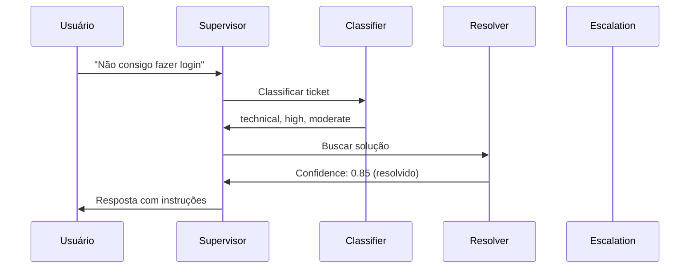
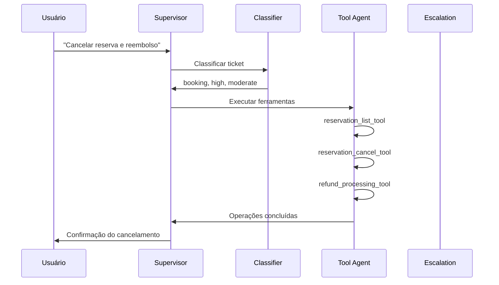

# 🤖 UDA-Hub: Sistema Multi-Agente de Suporte ao Cliente

[](https://www.python.org/)
[](https://www.langchain.com/)
[](https://www.langchain.com/langgraph)
[](https://openai.com/)

> Sistema inteligente de atendimento ao cliente baseado em arquitetura multi-agente com supervisor, utilizando IA Generativa para classificação, resolução e escalação automática de tickets.

## 📋 Índice

- [Visão Geral](#-visão-geral)
- [Arquitetura](#-arquitetura)
- [Funcionalidades](#-funcionalidades)
- [Tecnologias](#-tecnologias)
- [Estrutura do Projeto](#-estrutura-do-projeto)
- [Instalação](#-instalação)
- [Uso](#-uso)
- [Agentes](#-agentes)
- [Fluxo de Trabalho](#-fluxo-de-trabalho)
- [Exemplos](#-exemplos)

---

## 🎯 Visão Geral

O **UDA-Hub** (Unified Digital Assistant Hub) é um sistema avançado de suporte ao cliente que utiliza múltiplos agentes especializados coordenados por um supervisor inteligente. O sistema processa tickets de suporte, classifica problemas, busca soluções em bases de conhecimento, executa operações em bancos de dados e escala para atendimento humano quando necessário.

### Principais Características

- ✅ **Arquitetura Multi-Agente**: 4 agentes especializados trabalhando em conjunto
- ✅ **Supervisor Inteligente**: Roteamento automático baseado em contexto e confiança
- ✅ **RAG (Retrieval-Augmented Generation)**: Base de conhecimento para resolução de problemas
- ✅ **Execução de Ferramentas**: Consultas e operações em bancos de dados externos
- ✅ **Escalação Inteligente**: Detecta quando é necessário intervenção humana
- ✅ **Sistema de Logging Estruturado**: Rastreamento completo de decisões e ações
- ✅ **Memória de Longo Prazo**: Persistência de conversas e contexto do cliente
- ✅ **Interface CLI Interativa**: Testes em tempo real com feedback detalhado

---

## 🏗️ Arquitetura

O sistema utiliza uma arquitetura **Supervisor-Based Multi-Agent** implementada com LangGraph:

```
┌─────────────────────────────────────────────────────────────┐
│                        SUPERVISOR                           │
│              (Roteamento Inteligente)                       │
└───────────┬─────────────────────────────────────────────────┘
            │
            ├──────► CLASSIFIER AGENT
            │        └─ Classifica tipo, urgência e complexidade
            │
            ├──────► RESOLVER AGENT
            │        └─ Busca soluções na base de conhecimento (RAG)
            │
            ├──────► TOOL AGENT
            │        └─ Executa operações em bancos de dados
            │
            └──────► ESCALATION AGENT
                     └─ Prepara escalação para agente humano
```

### Fluxo de Decisão do Supervisor

1. **Verificação de Pedido Humano**: Detecta se usuário solicitou atendimento humano
2. **Classificação**: Encaminha tickets novos para análise inicial
3. **Avaliação de Confiança**: Decide se resolução é suficiente (≥0.7)
4. **Execução de Ferramentas**: Identifica necessidade de consultas ao banco
5. **Escalação**: Encaminha casos complexos ou não resolvidos

---

## 🚀 Funcionalidades

### 1. Classificação Automática
- Identifica tipo de problema (técnico, billing, conta, reserva, geral)
- Define urgência (baixa, média, alta, crítica)
- Avalia complexidade (simples, moderada, complexa)
- Extrai tags relevantes para busca

### 2. Resolução Baseada em RAG
- Busca em base de conhecimento usando embeddings
- Calcula score de confiança da resposta
- Utiliza múltiplos artigos quando necessário
- Determina se pode resolver ou precisa escalar

### 3. Ferramentas de Banco de Dados
- **User Lookup**: Busca informações do usuário
- **Subscription Check**: Verifica status de assinaturas
- **Experience Search**: Pesquisa experiências disponíveis
- **Reservation Management**: Cria, lista e cancela reservas
- **Refund Processing**: Processa solicitações de reembolso

### 4. Escalação Inteligente
- Resume o problema de forma concisa
- Lista todas as tentativas de resolução
- Define prioridade (P1-P4)
- Recomenda ações para agente humano
- Fornece contexto relevante

### 5. Sistema de Logging
- Logs estruturados em JSON
- Rastreamento de decisões de cada agente
- Métricas de performance
- Análise de conversas
- Exportação para auditoria

---

## 🛠️ Tecnologias

### Core
- **Python 3.13**: Linguagem principal
- **LangChain 0.3**: Framework para aplicações com LLMs
- **LangGraph 0.5**: Orquestração de workflows multi-agente
- **OpenAI GPT-4o-mini**: Modelo de linguagem

### Dados e Armazenamento
- **SQLAlchemy 2.0**: ORM para bancos de dados
- **FAISS**: Busca vetorial para RAG
- **SQLite**: Bancos de dados locais (core + externos)

### Ferramentas Auxiliares
- **python-dotenv**: Gerenciamento de variáveis de ambiente
- **httpx**: Cliente HTTP assíncrono
- **numpy**: Operações numéricas
- **ipykernel**: Suporte a Jupyter Notebooks

---

## 📁 Estrutura do Projeto

```
UDA-Hub/
├── agentic/                      # Sistema multi-agente
│   ├── agents/                   # Agentes especializados
│   │   ├── classifier.py         # Classifica tickets
│   │   ├── resolver.py           # Resolve com RAG
│   │   ├── tool_agent.py         # Executa ferramentas
│   │   ├── escalation.py         # Prepara escalação
│   │   ├── state.py              # Schema de estado compartilhado
│   │   └── wrappers.py           # Wrappers para agentes
│   ├── tools/                    # Ferramentas disponíveis
│   │   ├── rag_tools.py          # Sistema RAG
│   │   └── db_tools.py           # Ferramentas de banco de dados
│   ├── config.py                 # Configuração OpenAI
│   ├── logging.py                # Sistema de logging estruturado
│   ├── memory.py                 # Memória de longo prazo
│   ├── inspector.py              # Inspeção de estado
│   └── workflow.py               # Orquestração do workflow
│
├── data/                         # Bancos de dados
│   ├── external/                 # DB externo (CultPass)
│   ├── core/                     # DB core (UDA-Hub)
│   └── models/                   # Modelos de ML (embeddings)
│
├── logs/                         # Logs estruturados JSON
│
├── 01_external_db_setup.ipynb   # Setup banco externo
├── 02_core_db_setup.ipynb       # Setup banco core
├── 03_agentic_app.ipynb         # Aplicação principal
│
├── cli.py                        # Interface CLI interativa
├── utils.py                      # Utilitários
├── init_cultpass_db.py          # Script de inicialização
└── requirements.txt              # Dependências
```

---

## 📦 Instalação

### Pré-requisitos
- Python 3.13+
- OpenAI API Key

### Passos

1. **Clone o repositório**
```bash
git clone <url-do-repositorio>
cd UDA-Hub
```

2. **Crie um ambiente virtual**
```bash
python3 -m venv venv
source venv/bin/activate  # Linux/Mac
# ou
venv\Scripts\activate  # Windows
```

3. **Instale as dependências**
```bash
pip install -r requirements.txt
```

4. **Configure as variáveis de ambiente**
Crie um arquivo `.env` na raiz do projeto:
```env
OPENAI_API_KEY=sua-chave-api-aqui
OPENAI_MODEL=gpt-4o-mini
OPENAI_EMBEDDING_MODEL=text-embedding-3-small
# Opcional: Para Vocareum Gateway
# OPENAI_API_BASE=https://gateway.vocareum.com/v1
```

5. **Inicialize os bancos de dados**
Execute os notebooks na ordem:
- `01_external_db_setup.ipynb` - Cria banco de dados externo (CultPass)
- `02_core_db_setup.ipynb` - Cria banco de dados core (UDA-Hub)
- `03_agentic_app.ipynb` - Testa o sistema

---

## 💻 Uso

### Via CLI Interativo

```bash
python cli.py
```

**Opções disponíveis:**
```bash
# Com logs em tempo real
python cli.py --show-logs

# Com ID de sessão customizado
python cli.py --session-id TESTE-001

# Com memória de longo prazo
python cli.py --memory

# Com conta específica
python cli.py --account cultpass
```

**Comandos durante o chat:**
- `/help` - Mostra comandos disponíveis
- `/history` - Exibe histórico da conversa
- `/stats` - Mostra estatísticas da sessão
- `/logs` - Ativa/desativa logs em tempo real
- `/export` - Exporta conversa para arquivo
- `quit`, `exit`, `q` - Encerra a sessão

### Via Jupyter Notebook

Abra e execute `03_agentic_app.ipynb` para exemplos interativos e testes detalhados.

---

## 🤖 Agentes

### 1. Classifier Agent
**Responsabilidade**: Análise e classificação inicial do ticket

**Saída**:
```python
{
    "issue_type": "technical|billing|account|booking|general",
    "urgency": "low|medium|high|critical",
    "complexity": "simple|moderate|complex",
    "tags": ["tag1", "tag2", ...],
    "confidence": 0.95
}
```

**Exemplos de Classificação**:
- "Não consigo fazer login" → `technical`, `high`, `moderate`
- "Preciso cancelar reserva" → `booking`, `medium`, `simple`
- "Quero reembolso urgente" → `billing`, `high`, `moderate`

---

### 2. Resolver Agent
**Responsabilidade**: Resolução usando base de conhecimento (RAG)

**Processo**:
1. Busca artigos relevantes por similaridade vetorial
2. Gera resposta usando contexto dos artigos
3. Calcula confiança da resolução
4. Decide se pode resolver ou precisa escalar

**Saída**:
```python
{
    "resolved": True,
    "confidence": 0.85,
    "answer": "Para redefinir sua senha...",
    "articles_used": ["KB-123", "KB-456"],
    "escalation_reason": None
}
```

---

### 3. Tool Agent
**Responsabilidade**: Execução de ferramentas e operações em banco de dados

**Ferramentas Disponíveis**:

| Ferramenta | Descrição | Uso |
|------------|-----------|-----|
| `user_lookup_tool` | Busca dados do usuário | Verificar conta, status |
| `subscription_check_tool` | Verifica assinaturas | Planos, status, validade |
| `experience_search_tool` | Busca experiências | Disponibilidade, filtros |
| `reservation_list_tool` | Lista reservas | Histórico do usuário |
| `reservation_create_tool` | Cria nova reserva | Agendamentos |
| `reservation_cancel_tool` | Cancela reserva | Cancelamentos |
| `refund_processing_tool` | Processa reembolso | Devoluções |

**Exemplo de Uso**:
```
Usuário: "Quero cancelar minha reserva para yoga"
Tool Agent: Executa reservation_list_tool → reservation_cancel_tool → refund_processing_tool
```

---

### 4. Escalation Agent
**Responsabilidade**: Preparação para escalação humana

**Saída**:
```python
{
    "summary": "Cliente não consegue acessar conta há 3 dias",
    "attempted_steps": [
        "Tentativa de reset de senha (falhou)",
        "Verificação de email cadastrado (correto)",
        "Busca na base de conhecimento (sem solução)"
    ],
    "priority": "P2",  # P1=Crítico, P2=Alto, P3=Médio, P4=Baixo
    "recommended_action": "Verificar logs do servidor...",
    "context": {
        "user_id": "U12345",
        "account_id": "cultpass",
        "last_login": "2025-11-03",
        ...
    }
}
```

---

## 🔄 Fluxo de Trabalho

### Exemplo: Ticket de Login



### Exemplo: Ticket Complexo com Ferramentas



---

## 📊 Exemplos

### Exemplo 1: Problema Técnico (Resolvido)

**Input**:
```
Usuário: Estou com problema de login, não consigo acessar minha conta
```

**Processamento**:
1. **Classifier**: `technical`, `high`, `moderate`, `confidence: 0.92`
2. **Resolver**: Busca artigos sobre login → Gera resposta → `confidence: 0.88`
3. **Supervisor**: Confiança alta → **Finaliza**

**Output**:
```
Para resolver problemas de login:
1. Verifique sua conexão com a internet
2. Limpe o cache do navegador
3. Tente redefinir sua senha usando "Esqueci minha senha"
4. Se o problema persistir, entre em contato pelo email suporte@...
```

---

### Exemplo 2: Reserva com Ferramentas

**Input**:
```
Usuário: Quero cancelar minha reserva de yoga amanhã e receber reembolso
```

**Processamento**:
1. **Classifier**: `booking`, `medium`, `moderate`, `confidence: 0.95`
2. **Tool Agent**: 
   - Lista reservas do usuário
   - Identifica reserva de yoga
   - Cancela reserva
   - Processa reembolso
3. **Supervisor**: Operações concluídas → **Finaliza**

**Output**:
```
✅ Reserva cancelada com sucesso!

Detalhes:
- Experiência: Yoga Matinal
- Data: 2025-11-07 08:00
- Reembolso: R$ 50,00 (processado em até 5 dias úteis)
- Status: Cancelada

Número do reembolso: REF-789456
```

---

### Exemplo 3: Escalação Necessária

**Input**:
```
Usuário: Minha conta foi cobrada 3 vezes pelo mesmo serviço, preciso de ajuda urgente!
```

**Processamento**:
1. **Classifier**: `billing`, `critical`, `complex`, `confidence: 0.89`
2. **Resolver**: Tentativa de resolução → `confidence: 0.45` (baixa)
3. **Escalation**: Prepara resumo detalhado
4. **Supervisor**: Confiança baixa + complexidade → **Escala**

**Output**:
```
⚠️ Sua solicitação foi escalada para um agente humano.

Resumo: Cobrança duplicada (3x) - necessita verificação urgente
Prioridade: P1 (Crítica)
Tempo estimado de resposta: 2 horas

Um agente especializado entrará em contato em breve.
Protocolo: ESC-20251106-001
```

---

## 📈 Sistema de Logging

O UDA-Hub possui um sistema completo de logging estruturado em JSON:

### Tipos de Eventos
- `AGENT_START` / `AGENT_END`: Início e fim da execução de agentes
- `CLASSIFICATION`: Resultados da classificação
- `RESOLUTION_ATTEMPT`: Tentativas de resolução
- `TOOL_EXECUTION`: Execução de ferramentas
- `ESCALATION`: Eventos de escalação
- `ROUTING`: Decisões do supervisor
- `ERROR`: Erros durante execução

### Exemplo de Log
```json
{
  "timestamp": "2025-11-06T10:30:45.123Z",
  "event_type": "CLASSIFICATION",
  "agent": "classifier",
  "thread_id": "CLI-20251106-103045",
  "data": {
    "issue_type": "technical",
    "urgency": "high",
    "complexity": "moderate",
    "confidence": 0.92
  }
}
```

---

## 🎓 Aprendizados e Conceitos

Este projeto demonstra conceitos avançados de IA:

1. **Multi-Agent Systems**: Coordenação de agentes especializados
2. **RAG (Retrieval-Augmented Generation)**: Combinação de LLMs com bases de conhecimento
3. **Tool Calling**: Integração de LLMs com sistemas externos
4. **State Management**: Gerenciamento de estado compartilhado entre agentes
5. **Confidence Scoring**: Avaliação de qualidade de respostas
6. **Escalation Logic**: Decisões inteligentes sobre quando envolver humanos
7. **Structured Logging**: Rastreamento e auditoria de sistemas de IA
8. **Memory Systems**: Persistência de contexto e conversas

---

## 🚧 Melhorias Futuras

- [ ] Suporte a múltiplos idiomas
- [ ] Interface web (Streamlit/Gradio)
- [ ] Integração com sistemas de ticketing (Zendesk, Jira)
- [ ] Fine-tuning de modelos para domínio específico
- [ ] Métricas de satisfação do cliente
- [ ] Testes A/B de diferentes estratégias de resolução
- [ ] Sistema de feedback e aprendizado contínuo
- [ ] Análise de sentimento em tempo real

---

## 👨‍💻 Autor

**Mello Birkan**

Projeto desenvolvido como parte do portfólio de estudos em IA Generativa e Sistemas Multi-Agente.

---

## 📄 Licença

Este projeto é parte de um portfólio educacional e está disponível para fins de aprendizado.

---

## 🙏 Agradecimentos

- **LangChain** e **LangGraph** pela framework poderosa
- **OpenAI** pelos modelos de linguagem
- Comunidade open-source de IA

---

<div align="center">

**⭐ Se este projeto foi útil para você, considere dar uma estrela!**

</div>
