# System Diagrams

This document contains visual diagrams for the UDA-Hub multi-agent system using Mermaid syntax.

---

## 1. High-Level System Architecture

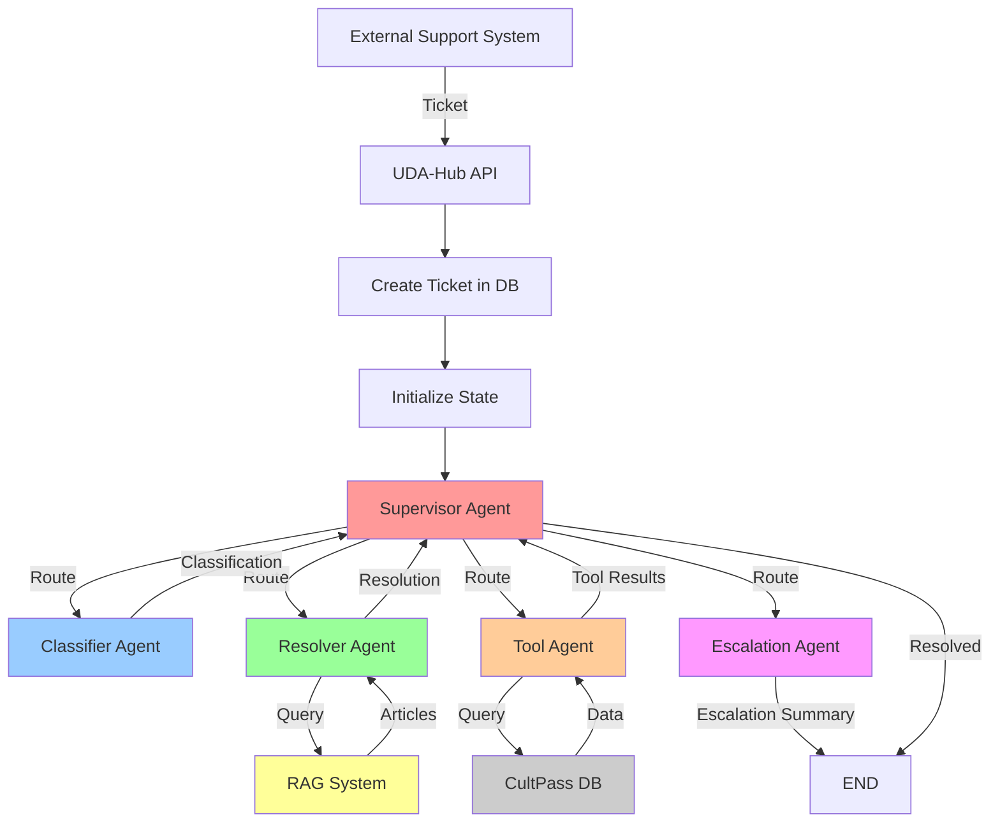

---

## 2. Supervisor Routing Flow

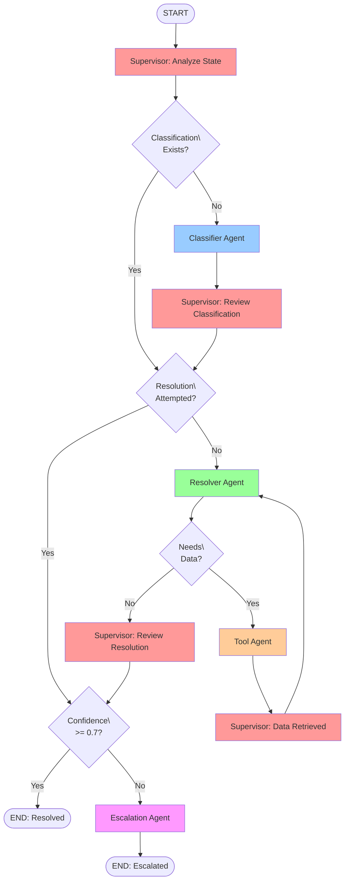

---

## 3. Agent Interaction Sequence

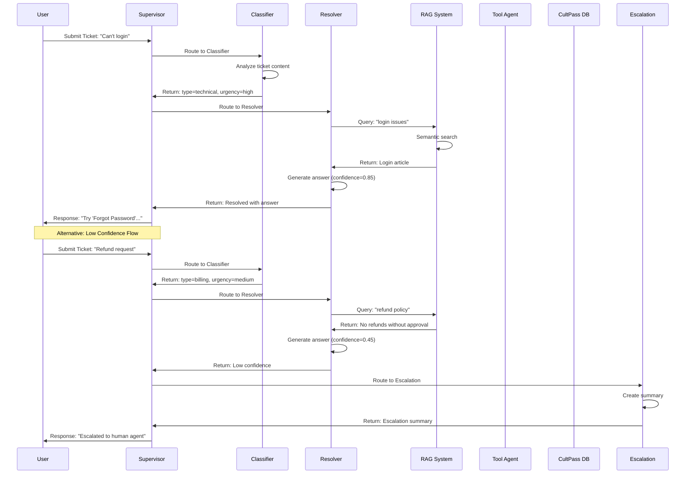

---

## 4. RAG System Architecture

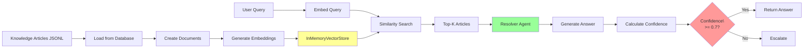

---

## 5. Memory Architecture

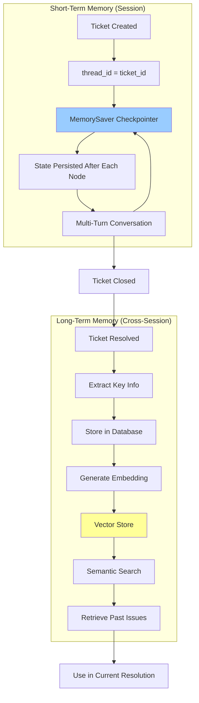

---

## 6. State Transition Diagram

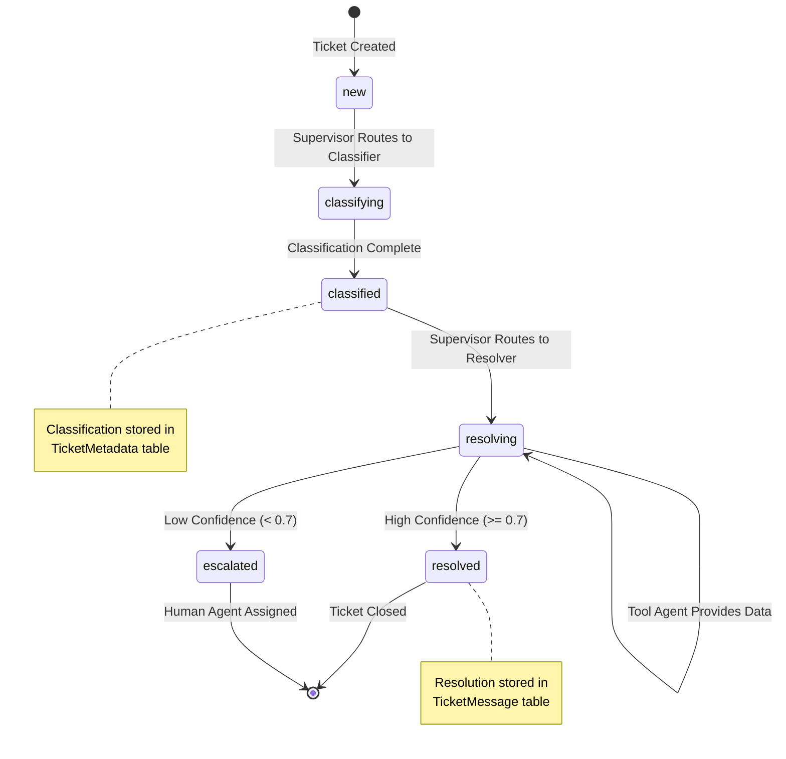

---

## 7. Tool Agent Operations

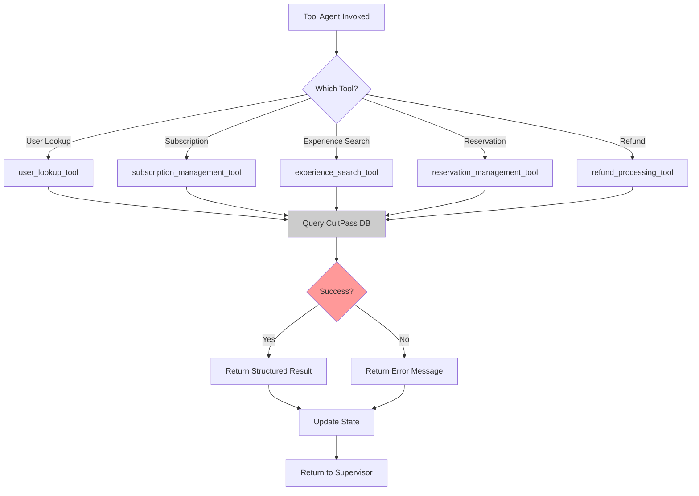

---

## 8. Confidence Scoring Flow

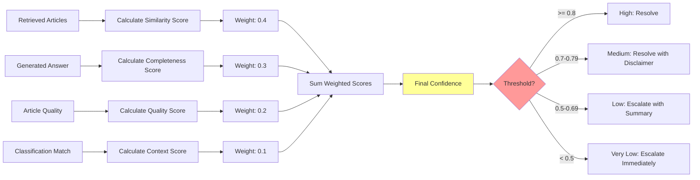

---

## 9. Database Schema Overview

```mermaid
erDiagram
    Account ||--o{ User : has
    Account ||--o{ Ticket : has
    Account ||--o{ Knowledge : has
    User ||--o{ Ticket : creates
    Ticket ||--|| TicketMetadata : has
    Ticket ||--o{ TicketMessage : contains

    Account {
        string account_id PK
        string account_name
        datetime created_at
    }

    User {
        string user_id PK
        string account_id FK
        string external_user_id
        string user_name
    }

    Ticket {
        string ticket_id PK
        string account_id FK
        string user_id FK
        string channel
        datetime created_at
    }

    TicketMetadata {
        string ticket_id PK_FK
        string status
        string main_issue_type
        string tags
    }

    TicketMessage {
        string message_id PK
        string ticket_id FK
        enum role
        text content
        datetime created_at
    }

    Knowledge {
        string article_id PK
        string account_id FK
        string title
        text content
        string tags
    }
```

---

## 10. Error Handling Flow

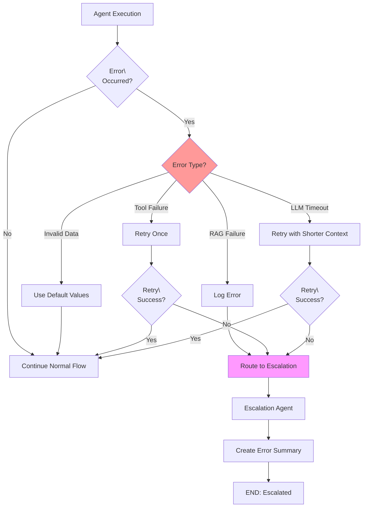

---

## 11. Multi-Turn Conversation Flow

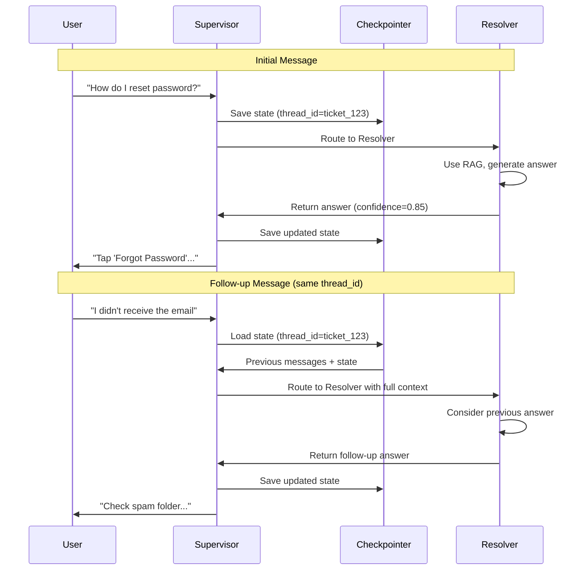

---

## 12. Ticket Lifecycle

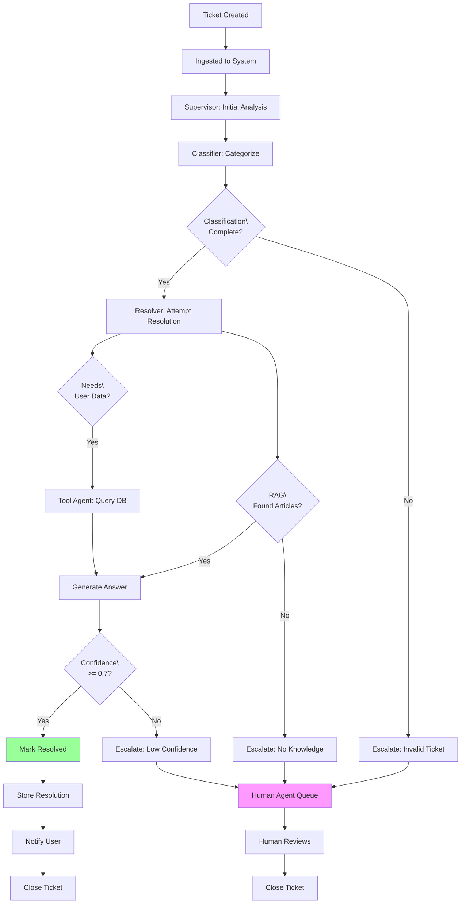

---

## 13. Knowledge Base Update Flow

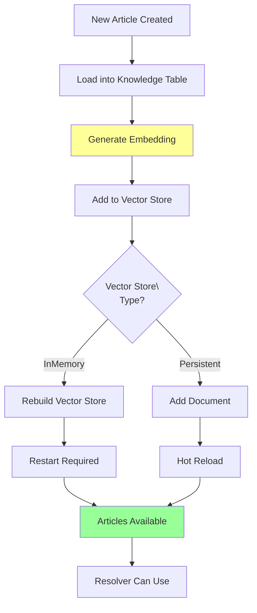

---

## 14. CultPass Database Integration

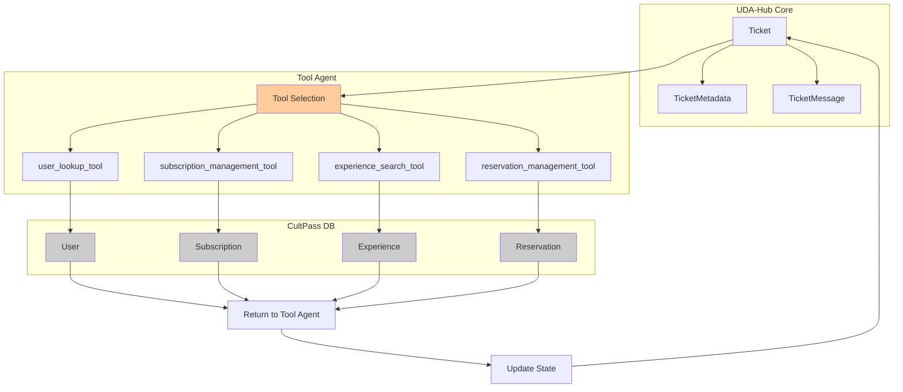

---

## 15. Escalation Priority Assignment

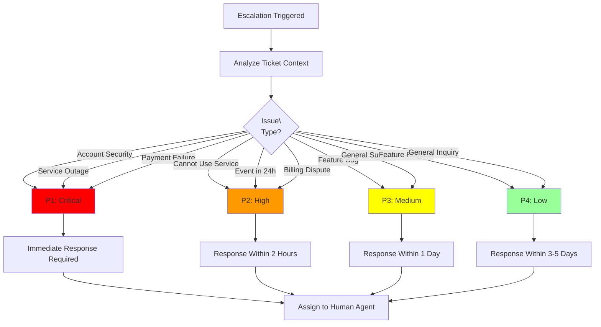

---

## Usage Notes

- **Diagram 1**: Shows overall system architecture and component relationships
- **Diagram 2**: Details supervisor decision logic and routing flow
- **Diagram 3**: Illustrates agent interactions in sequence for typical scenarios
- **Diagram 4**: Explains RAG system components and flow
- **Diagram 5**: Shows memory architecture for both short-term and long-term storage
- **Diagram 6**: State machine for ticket status transitions
- **Diagram 7**: Tool agent operations and database interactions
- **Diagram 8**: Confidence scoring calculation and thresholds
- **Diagram 9**: Database schema for UDA-Hub core system
- **Diagram 10**: Error handling and recovery strategies
- **Diagram 11**: Multi-turn conversation state management
- **Diagram 12**: Complete ticket lifecycle from creation to closure
- **Diagram 13**: Knowledge base update and hot reload process
- **Diagram 14**: Integration between UDA-Hub and CultPass databases
- **Diagram 15**: Escalation priority assignment logic

These diagrams should be referenced alongside the detailed documentation in other design files.

---

## Related Documentation

- **System Overview**: See `ARCHITECTURE.md`
- **Agent Details**: See `AGENT_SPECIFICATIONS.md`
- **Data Flow**: See `DATA_FLOW.md`
- **Memory**: See `MEMORY_STRATEGY.md`
- **RAG**: See `RAG_IMPLEMENTATION.md`
- **Index**: See `README.md`
